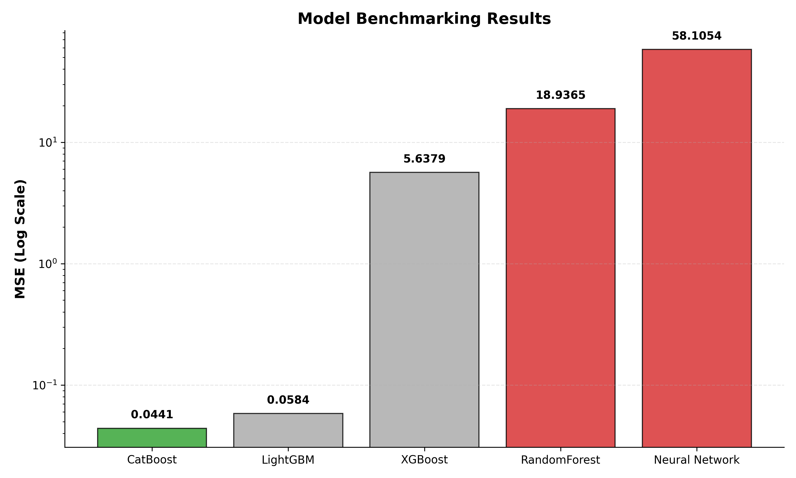
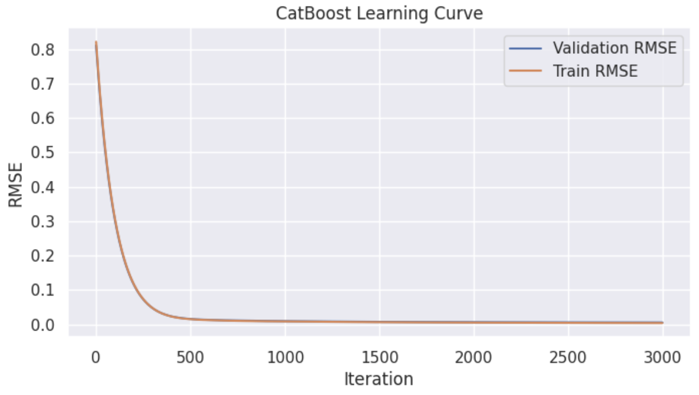

# Labor Cost Prediction (Production Pipeline)

---

## Confidentiality Notice (NDA)

**This project was originally developed and deployed on confidential company data.**

To comply with Non-Disclosure Agreements (NDA) and demonstrate the architecture in a public portfolio:
1.  **All proprietary data has been removed.**
2.  The provided notebook demonstrates the **production pipeline structure**, feature engineering logic, and model architecture without revealing sensitive information.

*Note: All metrics, plots, and results shown below (including the 0.99 R² score) were generated using the full, original confidential dataset.*

---

## Task

**Objective:** Predict the labor cost (time in minutes) required to complete a task based on its textual description (subject, details) and metadata (project, department, company context).

**Problem Type:** Regression on hybrid data (Text + Tabular).

---

## Tech Stack

* **Language:** Python 3.10+
* **Data Processing:** Pandas, NumPy, Scikit-learn
* **NLP:** * **Stanza** (Lemmatization)
    * **Transformers** (XLM-Roberta: `Zamza/XLM-roberta-large-ftit-emb-lr01`)
* **Machine Learning:** CatBoost, LightGBM, XGBoost, RandomForest
* **Deep Learning:** PyTorch (Feed-Forward Neural Network for benchmarking)
* **Dimensionality Reduction:** PCA (Principal Component Analysis)
* **Visualization:** Matplotlib, Seaborn

---

## Project Pipeline

### 1. Data Processing & EDA
* Analyzed distribution of labor costs, identifying a **heavy-tailed distribution**.
* Applied **Log-transformation (`np.log1p`)** to the target variable to stabilize variance and improve model convergence.
* Handled outliers using the Interquartile Range (IQR) method.

### 2. Feature Engineering
* **Aggregated Features:** Created statistical features (mean/median/std of labor costs) grouped by `company_id` and `project_name`.
* **Text Meta-features:** Extracted text length, keyword density, and special token counts.
* **Categorical Flags:** Generated boolean flags for specific task types (e.g., `is_subtask`, `is_rare_project`).

### 3. NLP & Embeddings
* **Preprocessing:** Text cleaned and lemmatized using `Stanza`.
* **Vectorization:** Utilized a pre-trained **XLM-Roberta** model to generate contextual embeddings (1024 dimensions).
* **Optimization (Crucial Step):** Applied **PCA** to reduce embedding dimensionality from **1024 to 256**.
    * *Impact:* Retained 95%+ of explained variance while significantly reducing training time and preventing overfitting on sparse data.

### 4. Modeling & Benchmarking
* Combined tabular features (40+) with compressed text embeddings (256).
* Benchmarked multiple approaches:
    * **Gradient Boosting:** CatBoost, XGBoost, LightGBM.
    * **Deep Learning:** Custom PyTorch Feed-Forward Network.
    * **Baselines:** Linear Regression, RandomForest.
* Hyperparameters optimized via `GridSearchCV`.

---

## Results (On Production Data)

The **CatBoost** model demonstrated the best performance, effectively handling the mix of categorical features and dense embeddings.

* **R² Score:** ~0.999
* **MSE:** 0.044
* **MAPE:** 0.15%

### Model Comparison (MSE)
> *Lower is better*

### Learning Curve (CatBoost)

---

## Author
**Bassar Baishev**
