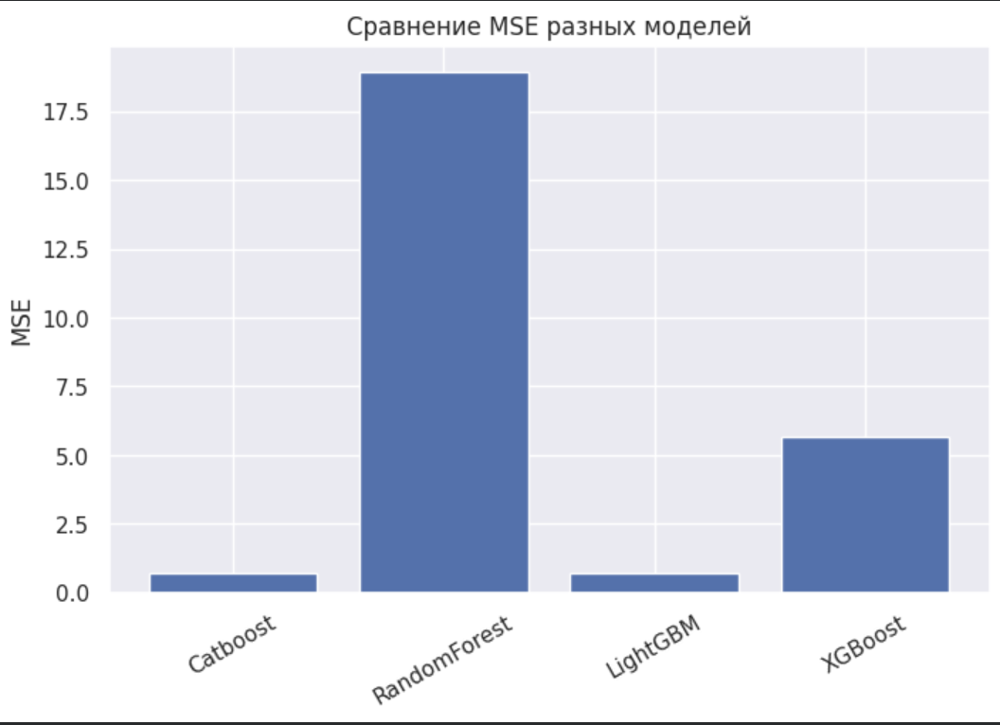
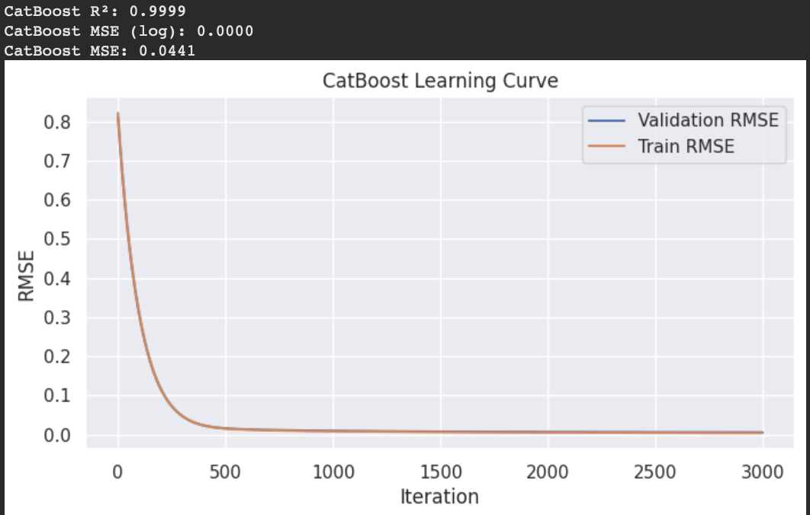

# Labor Cost Prediction

*Проект из портфолио, демонстрирующий навыки NLP, Feature Engineering и моделирования.*

---

## Примечание о конфиденциальности (NDA)

**Этот проект изначально выполнялся на конфиденциальных данных компании. Для демонстрации в публичном портфолио:**
1.  **Все реальные данные были удалены.**
2.  Ноутбук (`.ipynb`) был очищен от всех выводов (outputs).
3.  Для проверки работоспособности кода в него встроен **генератор синтетических (ненастоящих) данных**.

Все результаты, метрики и графики, представленные ниже (в виде скриншотов), были получены на **исходном, полном и конфиденциальном наборе данных**.

---

## Задача

Прогнозирование трудозатрат (в часах/минутах) на выполнение задачи на основе ее текстового описания (subject, details) и метаданных (проект, отдел, компания).

---

## Технологический стек

* **Язык:** Python
* **Анализ данных:** Pandas, NumPy, Matplotlib, Seaborn
* **NLP:** Stanza (лемматизация), Transformers (XLM-Roberta для эмбеддингов)
* **ML-модели:** CatBoost, LightGBM, RandomForest, XGBoost, Linear Regression
* **Deep Learning:** PyTorch (FeedForward NN)
* **Среда:** Google Colab (GPU)

---

## Пайплайн проекта

1.  **Генерация синтетических данных:** (Для целей портфолио) Создание датасета, имитирующего структуру реальных данных.
2.  **EDA и очистка:** Анализ распределений, обработка выбросов (по методу IQR), заполнение пропусков.
3.  **Feature Engineering:**
    * Создание агрегированных фичей (средние/медианы/std трудозатрат по `company_id`, `project_name` и т.д.).
    * Текстовые фичи (длина текста, наличие ключевых слов).
    * Категориальные флаги (`is_subtask`, `is_rare_project`).
4.  **NLP (Эмбеддинги):**
    * Текст лемматизировался с помощью `Stanza`.
    * Леммы подавались в модель **XLM-Roberta** (`Zamza/XLM-roberta-large-ftit-emb-lr01`) для получения эмбеддингов (векторов) по каждому тексту.
    * Размерность эмбеддингов (1024) была понижена до 256 с помощью `PCA` для ускорения обучения моделей.
5.  **Моделирование:**
    * Эмбеддинги (256) и созданные фичи (40+) были объединены.
    * Были обучены и сравнены 5+ моделей. Целевая переменная (`labor_costs`) логарифмировалась (`log1p`) для стабилизации.
    * Лучшие гиперпараметры подбирались через `GridSearchCV`.

---

## Результаты (Получены на реальных данных)

Лучший результат показала модель **CatBoost** за счет продвинутой работы с категориальными признаками и эмбеддингами.

### Сравнение моделей (по MSE)
### 

### Кривая обучения (CatBoost)
### 

---

## Author
**Bassar Baishev**
